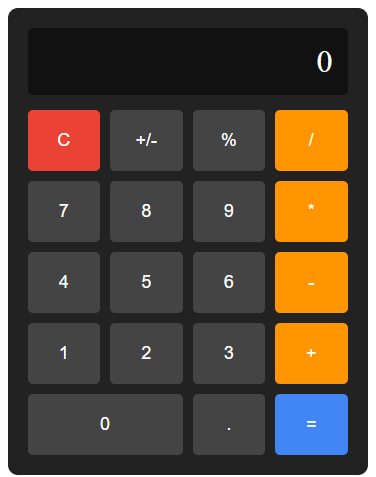

# 🧮 Simple Calculator

A fully functional calculator built with pure HTML, CSS, and JavaScript.
No frameworks. No libraries. Just the basics.

Built as part of my Full Stack Developer journey in 2026.

---

## 📸 Preview



---

## ✅ Features

- Basic arithmetic — addition, subtraction, multiplication, division
- Percentage calculation (50% → 0.5)
- Toggle positive/negative numbers (+/-)
- Clear button to reset display
- Error handling for invalid calculations
- Clean dark UI similar to iPhone calculator

---

## 🛠️ Built With

| Technology | Purpose |
|-----------|---------|
| HTML | Structure and layout |
| CSS | Styling and CSS Grid layout |
| JavaScript | Button logic and calculations |

---

## 📁 Project Structure

```
Calculator/
│
├── Calculator.html   → Main HTML file (structure)
├── Calculator.css    → Styles (colors, grid, layout)
├── Calculator.js     → Logic (what happens when buttons are clicked)
└── README.md         → This file
```

---

## 🧠 What I Learned

- How to structure HTML properly
- CSS Grid for button layout
- JavaScript DOM manipulation
- Event listeners and click handling
- How `eval()` works for math expressions
- Error handling with `try/catch`
- Why `<script>` tag must go at bottom of HTML

---

## 🚀 How To Run

1. Download or clone this repository
2. Open `Calculator.html` in any browser
3. Start calculating

No installation needed. No dependencies. Just open and use.

---

## 👨‍💻 Author

**Dhruba**
- GitHub: [@dhruba2601](https://github.com/dhruba2601)
- Location: Guwahati, Assam, India
- Status: Learning Full Stack Development

---

## 📅 Timeline

| Day | What was built |
|-----|---------------|
| Day 1 | HTML structure, basic layout |
| Day 2-3 | CSS styling, colors, box-shadow |
| Day 4 | CSS Grid layout, button organization |
| Day 5 | JavaScript logic, all buttons working |

---

*This is project 2 of my full stack development journey.
Built without tutorials — only MDN docs and problem solving.*